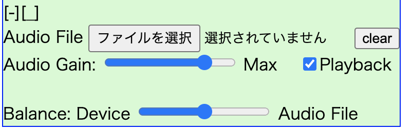

# Chrome Audio Mix

navigator.mediaDevices.getUserMedia()をフックし、マイクの音に音声ファイルをミックスするChrome Extensionです。

Chrome extention for mixing microphone and audo file sound, using hook of navigator.mediaDevices.getUserMedia()

## Reference / 参考にしたもの

- https://github.com/hasegawayosuke/vitamin-meeeeet (MIT LICENSE)

## リポジトリ

- https://github.com/mganeko/chrome_audio_mix

## 使い方

### インストール

- リポジトリをダウンロード or クローン
- 必要に応じて、manifest.jsonを編集する
  - content_scripts, permissions のセクションを編集し、使いたいサイトを追加する
  - 同様に、使いたくないサイトを除外する
- Chrome の [その他のツール]-[拡張機能] の設定ページを開く
- 「デベロッパーモード」を有効にする
- ダウンロードしたリポジトリのフォルダーを選択し、読み込む
- 拡張機能のページで、読み込んだ「Chrome Audio Mix」が表示、有効なのを確認

### 実行

- 対象サイトをChromeで開く（現在の対象は次の通り）
  - http://localhost:*/* ... ローカルホスト環境
  - http://127.0.0.1:*/* ... ローカルホスト環境
  - https://mganeko.github.io/* ... mganeko の Github Pages
  - https://sora-labo.shiguredo.jp/* ... Sora Labo の検証ページ
  - https://meet.google.com/* ... Google Meet （使い方には注意が必要）
- 拡張機能が読み込まれる
  - mediaDevices.getUserMedia() をフックする
- 左上に小さなパネルが表示される
  - [+]ボタン ... クリックすると、パネルの中身を表示
  - [-]ボタン ... クリックすると、パネルを最小化
  - [_]ボタン ... クリックすると、パネルが左下に移動
  - [^]ボタン ... クリックすると、パネルが左上に移動
- [+]ボタンをクリックして、パネルの中身を表示後に操作
  - Audio File ... ミックスする音声ファイルを選択
    - [clear]ボタン ... ファイル選択をクリア（再生を停止）
  - Audio Gain ... 再生する音量を調整デバイス
    - [Playback] ... チェックすると、音声をモニター再生
  - Balance: Device(マイク) ←→ Audio File（音声ファイル）のバランスを調整
- 対象サイトで、カメラ映像/マイク音声の取得を開始、通信を開始
  - mediaDevices.getUserMedia()が呼び出されると、フックした処理が動き、マイクと音声がミックスされる
- ※音声ファイルが選択されていない場合は、フックではなく元のgetUserMedia()を呼び出す

パネルの中身を表示したところ
 

### 注意点

- 対象サイトがロードと同時にカメラ/マイクを取得する場合 (mediaDevices.getUserMedia()を呼び出す場合)、フックが有効にならず本来のデバイスのカメラ映像/マイク音声が取得される
  - そのページをリロードせずに再度カメラ/マイクの取得を行うと、フックが有効になる
- Google Meet もロードと同時にカメラ/マイクを取得するので、これに該当する
  - パネルで音声ファイルを選択後、マイクを切り替えるとマイクが再取得されるため、フックが有効になる
  -「その他のオプション」-「設定」でダイアログを表示
  - ダイアログで「音声」を選択後、マイクを切り替えて、また戻す

## LICENSE / ライセンス

- MIT LICENSE / MITライセンス

